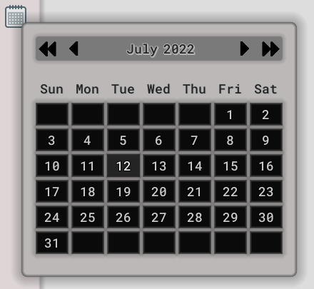

# Godot Calendar

A simple calendar with VERY basic functionality to select day, month, and year. 



## How to Use

Simply clone the repository and add the scene to your project. The calendar only has a single signal that returns the date (day, month, and year) as a dictionary. 

```gdscript
onready var calendar = $Calendar

func _ready():
    calendar.connect("date_selected", self, "print_date")

func print_date(date):
    print("date selected: ", date)
    print("weekday: ", calendar.get_weekday(date))
```


## TODO

- [ ] Better define popup/hide behavior.

- [ ] Add dates for before and after current month.

- [ ] Add method to get daylight savings for selected date.

- [ ] Make more customizable??
